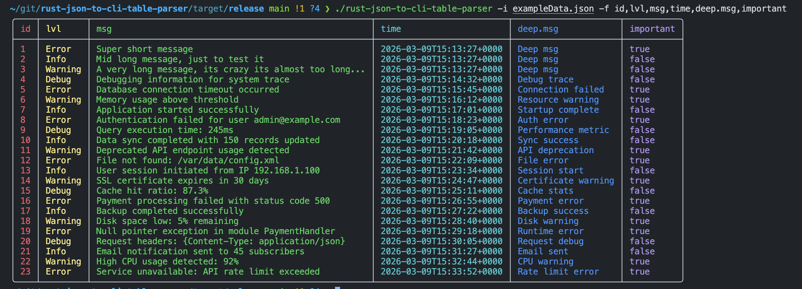

# rust-json-to-cli-table-parser

Small Rust CLI tool that prints a JSON array as a table in terminal.

## What it supports

- Select and order columns with `-f`.
- Nested fields with dot notation, for example `deep.msg`.
- String, number, boolean, and null values.
- Colored column output.

## Requirements

- Rust (stable)
- Cargo

## Run

```bash
cargo run -- -i exampleData.json -f lvl,msg,time,deep.msg
```

## CLI flags

- `-i, --input` path to input JSON file
- `-f, --fields` comma-separated field list in output order

## Input format

Input JSON must be an array of objects.

## Example



